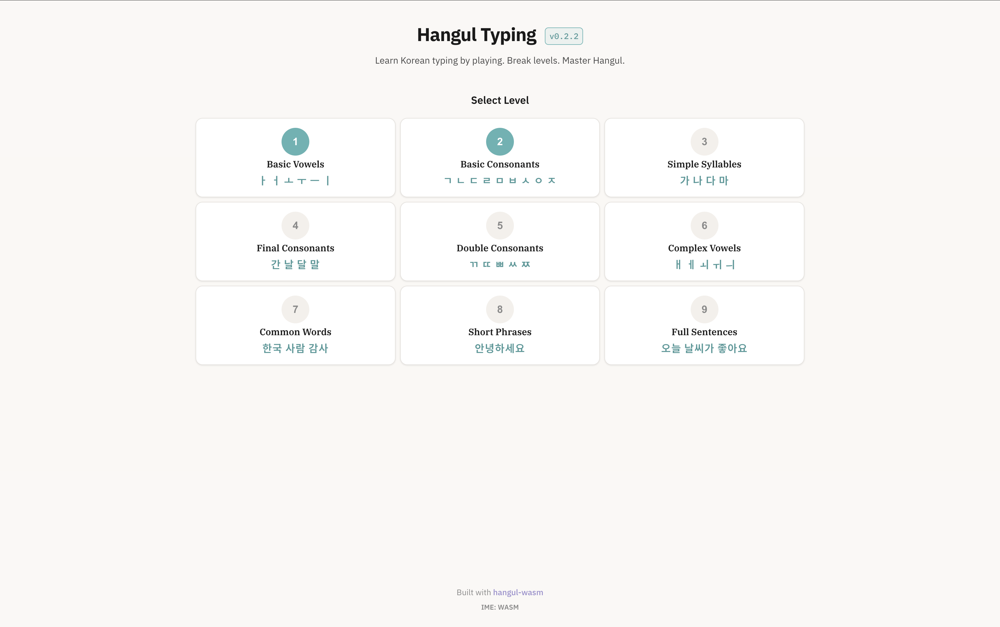
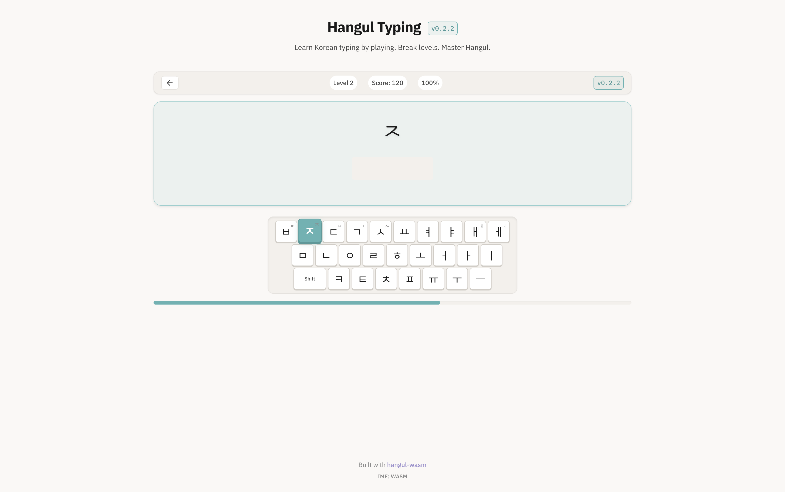

# Hangul Typing

Learn Korean typing by playing. Break levels. Master Hangul.

## About

A gamified typing trainer designed for non-Korean speakers. Progress through levels, build muscle memory, and unlock new challenges as you learn to type Hangul naturally.

## Features

- **Level-based progression** - Start from basic jamo and advance to full sentences
- **Game mechanics** - Score points, break levels, track your improvement
- **Instant feedback** - Real-time Hangul composition as you type
- **AI Assistant** - GitHub Copilot-powered tutor for contextual help (desktop app only)

## Screenshots

| Level Selection                                  | Typing                               |
|--------------------------------------------------|--------------------------------------|
|  |     |

## AI Assistant (Desktop Only)

The desktop app includes an optional AI-powered Korean typing tutor, powered by GitHub Copilot:

- **Contextual explanations** - Ask about any Hangul character or syllable
- **Typing hints** - Get help when you're stuck on a character
- **Mistake analysis** - Understand what went wrong and how to fix it
- **Natural language Q&A** - Ask anything about Korean typing

**Requirements:**
- GitHub Copilot CLI installed (`copilot` or `gh copilot`)
- GitHub CLI authenticated (`gh auth login`)

The assistant is automatically enabled when Copilot is available. Without it, the app works normally - AI features are entirely optional.

## Design Principles

- **Professional presentation** - Clean, polished interface
- **60:30:10 color rule** - Visual harmony through balanced color distribution
  - 60% warm cream backgrounds (`#faf8f5`)
  - 30% white cards and neutral text (`#ffffff`, `#1a1a1a`)
  - 10% soft teal accent for CTAs and highlights (`#5eb3b3`)
- **Line-only icons** - Minimal, consistent iconography

## Tech Stack

| Layer     | Technology         |
|-----------|--------------------|
| Core      | Zig                |
| Runtime   | WebAssembly        |
| Desktop   | Tauri (macOS)      |
| Frontend  | HTML / CSS / JS    |
| AI        | GitHub Copilot SDK |

Powered by [hangul.wasm](https://github.com/pastel-sketchbook/hangul-wasm) for Hangul decomposition, composition, and IME.

## Getting Started

### Prerequisites

- [Zig](https://ziglang.org/) (0.13+)
- [Bun](https://bun.sh/) (for TypeScript build)
- [Task](https://taskfile.dev/) (task runner)
- [Rust](https://rustup.rs/) (for Tauri desktop app)

### Development

```bash
# Build WASM and TypeScript
task default

# Run desktop app (development mode)
task run:dev

# Run as web app
task run:web

# Run with debug logging (shows Copilot internals)
RUST_LOG=debug task run:dev
```

### Building

```bash
# Build Tauri desktop app for macOS
task build:tauri

# Output: target/release/bundle/macos/Hangul Typing.app
```

### Release

```bash
task release:patch  # Bug fixes (0.3.0 → 0.3.1)
task release:minor  # New features (0.3.0 → 0.4.0)
task release:major  # Breaking changes (0.3.0 → 1.0.0)
```

## License

GPL-2.0-or-later